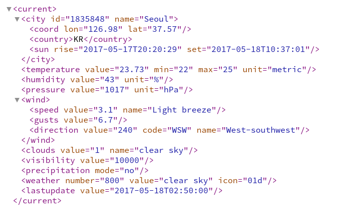

```{r setup, include=FALSE}
knitr::opts_chunk$set(echo = TRUE)
```

## 대한민국 도시별 기온 정보 시각화

이번 포스팅은 U of Iowa의 Luke Tierney 교수님의 Visualization [강의 노트](http://homepage.divms.uiowa.edu/~luke/classes/STAT4580/weather.html#temperatures-and-locations-for-some-iowa-cities)와 데이터 과학 [지리정보 시각화](http://statkclee.github.io/data-science/geo-info.html) 사이트에서 영감을 받아 작성하였습니다. 

  - 이번 포스팅의 목표: 대한민국의 각 도시별 현재 기온을 지도 위에 시각화하기 위한 데이터 준비
  
### 사용된 R 팩키지들

```{r, message=FALSE}
library(tidyverse)
library(magrittr)
library(xml2)
library(jsonlite)
```

### 현재 기온 정보 가져오기

[Open Weather Map](http://openweathermap.org/) 홈페이지는 세계의 날씨정보를 JSON이나 XML 형식으로 돌려주는 [API](http://openweathermap.org/api)를 제공한다. API를 이용하기 위해서는 홈페이지에서 회원가입을 하면 제공되는 무료 key를 받아서 사용해야 한다.

이 포스팅에서는 URL을 사용하여 XML 형식으로 정보를 불러오는 방식에 대하여 알아보자.

Open Weather Map API를 통해서 전 세계의 도시들의 기상 정보를 불러오는 방법은 크게 도시명을 이용해서 불러오는 방법과 위도, 경도를 이용해서 불러오는 방법으로 나뉜다. 

제공받은 키를 입력해서 아래의 형식에 맞춰 인터넷 브라우져에 다음과 같이 입력하여 보자.

```{r eval = FALSE}
http://api.openweathermap.org/data/2.5/weather?lat=37.5683&lon=126.9778&mode=xml&appid=무료제공키
```

위의 url에 입력된 위도 경도의 값은 서울시의 위도, 경도 정보이다. 만약 무료제공키를 받는데에 성공하였다면 다음과 같은 화면을 브라우저 상에서 받아볼 수 있을 것이다.



먼저 위의 정보를 `xml2`팩키지의 `read_xml()` 함수를 이용하여 `R`로 불러와 보자.

```{r echo=FALSE}
mykey <- "2c0b6079a602eea53fb9f51618845b80"
```

```{r}
base <- "http://api.openweathermap.org/data/2.5/weather"
url <- sprintf("%s?lat=%f&lon=%f&mode=xml&units=metric&appid=%s",
               base, 37.5683, 126.9778, mykey)
read_xml(url)
```

정보를 쭉 살펴보면 우리가 원하는 서울시의 현재 기온 정보가 `<temperature>` 태그 안에 "value" 항목 23.73도로 들어있는 것을 알 수 있다. 다음의 `R`코드는 위의 정보 중 첫번째 temperature태그의 value항목을 가져오는 함수이다.

```{r}
findTempbyGeo <- function(lat, lon) {
    base <- "http://api.openweathermap.org/data/2.5/weather"
    url <- sprintf("%s?lat=%f&lon=%f&mode=xml&units=metric&appid=%s",
                   base, lat, lon, mykey)
    page <- read_xml(url)
    as.numeric(xml_text(xml_find_first(page, "//temperature/@value")))
}
findTempbyGeo(37.5683, 126.9778)
```

위와 같은 함수의 경우 특정 좌표를 알고 있으면 날씨 정보를 손쉽게 가져올 수 있게 해준다. 하지만 만약 우리가 우리나라의 현재 기온정보를 불러와 표현하고 싶다면, 우리가 기온 정보를 알고 싶어하는 도시의 위치정보를 일일이 알아야만 하는 수고로움이 있다. Open Weather Map의 API는 이런 경우를 위해 특정 범위내의 날씨정보를 한번에 가져오는 기능을 제공한다. 단, 이 경우 반환값이 JSON 포맷으로 제공하므로, `jsonlite` 팩키지를 사용하도록 하자.

다음은 대한민국의 최극단 위도와 경도의 정보이다. 좌표는 [데이터 과학](http://statkclee.github.io/data-science/geo-info.html)를 참고 하였다. 

```{r}
KrLocation <- c(124.11, 33.06, 131.52, 43.00)
southKrLocation <- c(125.04, 33.06, 131.52, 38.27)
```


```{r}
findTempbyBox <- function(Loc_vec, zoom) {
    base <- "http://api.openweathermap.org/data/2.5/box/city"
    url <- sprintf("%s?bbox=%f,%f,%f,%f,%i&cluster=yst&appid=%s",
                   base, Loc_vec[1], Loc_vec[2], Loc_vec[3], Loc_vec[4], zoom, mykey)
    icjson <- fromJSON(url)
    icjson$list %$% tibble(city = unlist(name),
                           lon = coord$Lon, lat = coord$Lat,
                           temp = unlist(main$temp))
}
myData <- findTempbyBox(southKrLocation, 10)
head(myData)
```

자료를 살펴보면 주어진 지도상의 사각형에 속한 도시들이 잘 붙어있는 것을 알 수 있다. 하지만, 주어진 사각형 안에는 중국과 일본의 일부 영토가 속해있어서 일본이나 중국에 속한 도시들은 제외해주어야 한다. 따라서 도시이름에 따른 나라를 판단하는 함수를 작성하면 좋을 것이다. 사실 나라이름으로 검색하는 기능이 있다면 훨씬 편하겠지만, 아쉽게도 Open Weather Map에서는 제공되지 않는다. 

Open Weather Map API [설명서](http://openweathermap.org/current)에 따르면 도시 이름으로 검색을 할 경우 나라 이름을 거꾸로 유추할 수 있는 것을 알 수 있다. 따라서 다음과 같이 도시 이름을 이용하여 나라 이름을 불러오는 함수를 작성할 수 있다.

```{r}
findCountrybyCity <- function(cityname) {
    base <- "http://api.openweathermap.org/data/2.5/weather"
    url <- sprintf("%s?q=%s&appid=%s",
                   base, cityname, mykey)
    page <- fromJSON(url)
    page$sys$country
}
findCountrybyCity("Kunsan")
```

이 함수를 이용하여 앞에서 만든 `myData`에 country 항목을 나타내 보도록 하자. `map` 함수를 이용하여 각 도시에 대응되는 나라 이름을 담고 있는 벡터를 만든 후, 우리가 가지고 있는 데이터 베이스에 이어서 붙인다.
```{r}
country <- myData %$% city %>% map_chr(findCountrybyCity)
myData <- mutate(myData, country = country) %>% select(country, everything())
head(myData)
```

dplyr 팩키지의 `filter()` 함수를 사용하면, 위의 데이터 중에서 한국의 도시만을 선택하여 데이터를 생성할 수 있다.
```{r}
KrCities <- myData %>% filter(country == "KR")
dim(KrCities)
```

이제까지 우리는 총 91개의 한국에 위치는 도시의 지리정보와 현재 기온 정보를 웹상에서 불러와 데이터 베이스로 작성하는 것에 대하여 알아보았다. 다음 포스팅에서는 작성된 데이터 베이스를 가지고 지도위에 시각화 하는 것에 대하여 다루어 보도록 하겠다.